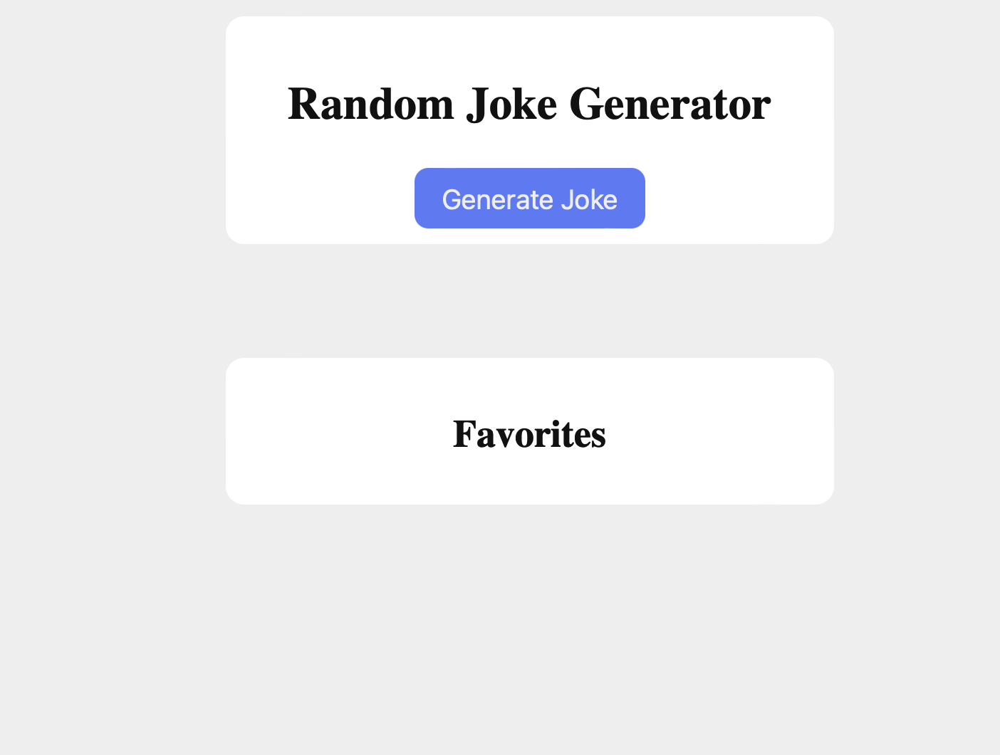
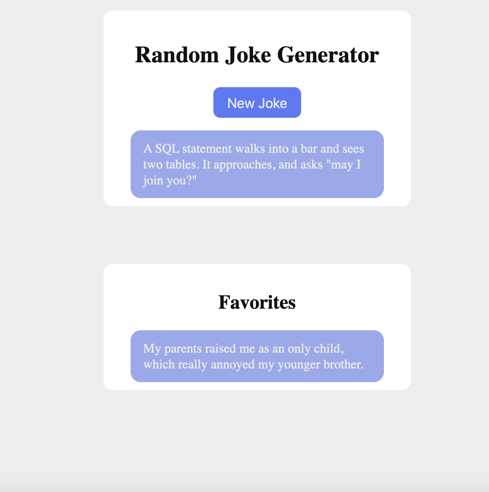

# Procesverslag
**Auteur:** -Sasja de Boer-

**De opdrachten:** [opdracht 1](opdracht1/index.html) en [opdracht 2](opdracht2/index.html)

Markdown is een simpele manier om HTML te schrijven.  
Markdown cheat cheet: [Hulp bij het schrijven van Markdown](https://github.com/adam-p/markdown-here/wiki/Markdown-Cheatsheet).

Nb. De standaardstructuur en de spartaanse opmaak van de README.md zijn helemaal prima. Het gaat om de inhoud van je procesverslag. Besteedt de tijd voor pracht en praal aan je website.

Nb. Door *open* toe te voegen aan een *details* element kun je deze standaard open zetten. Fijn om dat steeds voor de relevante stuk(ken) te doen.

## Bronnenlijst
  1. https://codepen.io/rociopromerosanchez/pen/GRWvZQM (voor het domino effect)
  2. https://codepen.io/shooft/pen/gOBWzOV?editors=1100 (code van Sanne voor begin domino)
  2. https://developer.mozilla.org/en-US/docs/Web/CSS/clamp (voor het responsive maken)
  3. https://dev.to/shantanu_jana/random-joke-generator-using-javascript-2011 (opdracht2, de code om de basis van de joke generator te maken)
  4. https://developer.mozilla.org/en-US/docs/Web/API/HTML_Drag_and_Drop_API (drag and drop, ook bij guides en dan 'drag operations')
  5. https://www.w3schools.com/html/html5_draganddrop.asp (drag and drop)
  6. https://freesound.org/people/Alexhanj/sounds/528730/ (ping geluid)

## Opdracht 1 plan

  
uitwerken na schetsen idee (voor week 2)

  ### Je storyboard:
  

  ### Je ambitie: 
  Aan deze technieken/punten wil ik werken:
  - De letters laten veranderen in blokjes.
  - De blokjes zo draaien dat het een goed effect geeft.
  - De timing van de animatie, wanneer moet het volgende blokje "vallen".
  - Dat het helemaal goed mee schaalt, met hoe groot het scherm is.
 

## Opdracht 1 reflectie

  
uitwerken bij afronden opdracht (voor week 4)

  ### Je uitkomst - karakteristiek screenshot(s):
  
  

  ### Dit ging goed/Heb ik geleerd: 
  Korte omschrijving met plaatje(s)
  - Ik heb geleerd hoe je uberhaupt een animatie moet maken. Ik snapte er vrij weinig van en ik heb veel moeten opzoeken en uitzoeken, allereerst om te begrijpen hoe alles werkt. Uiteindelijk snap ik het nu wel wat beter.
  - Wat ik ook heb geleerd is om het logo met before neer te zetten. Ik had eerst geen idee hoe ik dat logo daar ging krijgen, maar met before en background image is het uiteindelijk gelukt. Ook had ik nog nooit met gradient gewerkt, maar dit werkt goed voor mijn logo.

  

  ### Dit was lastig/Is niet gelukt:
  Korte omschrijving met plaatje(s)
  - Het responsive maken, was eerst even last. Dit kwam omdat ik geen idee had hoe dit moest en dan wordt het ook lastig waar je op moet zoeken. Uiteindelijk herkende ik weer van de les hoe dit moest en toen kon ik beter zoeken en was het uiteindelijk helemaal niet zo lastig. Ik heb nu alleen dat het schaalt als je de breedte veranderd, maar zou dit eigenlijk ook wilen met de hoogte.

  

## Opdracht 2 plan

  
uitwerken na schetsen idee (voor week 5)

  ### Je ontwerp:
  

  ### Je ambitie: 
  Aan deze technieken/punten wil ik werken:
  - Dat de animatie start met een klik.
  - Dat de balletjes precies goed rollen en optijd stoppen en dan vallen.
  - Hoe je iets op een goede manier kan opslaan.
  - Hoe je een mop "random" kan kiezen en ook elke keer/dag een andere.

## Opdracht 2 test

  
uitwerken na testen (week 7)

  Neem minimaal 5 bevindingen op:

  ### Bevinding 1:
  Wanneer je een meerdere moppen toevoegd aan het lijstje, dan wordt het een hele lange lijst die buiten beeld gaat.

  #### oplossing:
  Ik heb in de css een max-height gegeven aan de section van favorites en daarna overflow: auto, die zorgt ervoor dat je kan scrollen wanneer de content niet mee erin past.

  ### Bevinding 2:
  Geluid is toegevoegd wanneer je een mop plaats in het favorietenlijstje, deze is niet te horen op github wel op safari.

  #### oplossing:
  Ik heb Eva een berichtje gestuurd, met de vraag of zij mij wilt helpen. Ik had bij het path in de javascript een ./ ervoor moeten zetten, want toen ik dat deed toen werkte het geluid wel.

  ### Bevinding 3:
  De moppen kunnen nog niet verwijderd worden, alleen maar toegevoegd.

  #### oplossing:
  Ik heb uiteindelijk in de code een aanpassing gedaan. Wanneer je op een mop klikt wordt de functie removeFromFavorites uitgevoerd en dan wordt de mop verwijderd met een kleine fade-out animatie.
  

  ### Bevinding 4:
  Er is nog geen animaties, deze moet nog worden toegevoegd aan de site.

  #### oplossing:
  De animatie heb ik toegevoegd bij het verwijderen van een mop. In de css heb ik een korte animatie gemaakt die getoond wordt wanneer je op de mop klikt in het favorietenlijstje.

  ### Bevinding 5:
  Een mop kan je heel vaak toevoegen aan het lijstje.

  #### oplossing:
  Dit heb ik uiteindelijk opgelost door de functioon isInFavorites toe te voegen, die controleert of de mop al in het lijstje staat. Ook in de function drop staat bij de onderdaan dat de mop wordt toegevoegd als die nog niet in het favorietenlijstje staat.

## Opdracht 2 reflectie

  
uitwerken bij afronden opdracht (voor week 8)

  ### Je uitkomst - karakteristiek screenshot(s):
  
  

  ### Dit ging goed/Heb ik geleerd: 
  Ik heb tijdens deze opdracht veel geleerd. Allereerst hoe je een API kan ophalen en kan gebruiken. 
  Ook het drag and drop had ik nog nooit gedaan en na wat puzzelen was dat ook helemaal gelukt.
  Door de vorige opdracht, wist ik dat ik met clamp ervoor kon zorgen dat alles goed mee schaalt.

  

  ### Dit was lastig/Is niet gelukt:
  Wat ik lastig vond was om alle verschillende dingen goed op elkaar aan te laten sluiten, ik heb hierbij hulp gevraagd zodat het goed op elkaar aansluit. Uiteindelijk is het voor het grootste gedeelte gelukt. In mijn ontwerp had ik eerst iets getekent met een balletje, helaas is dat er niet meer van gekomen doordat ik daar geen tijd meer voor had.

  

