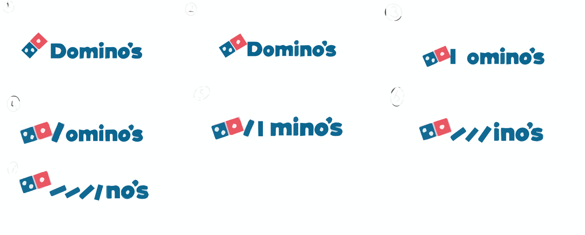
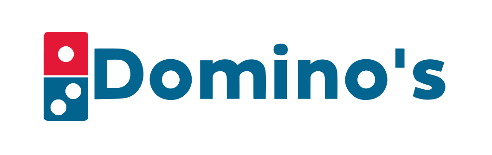
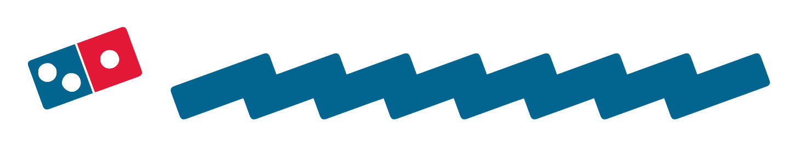
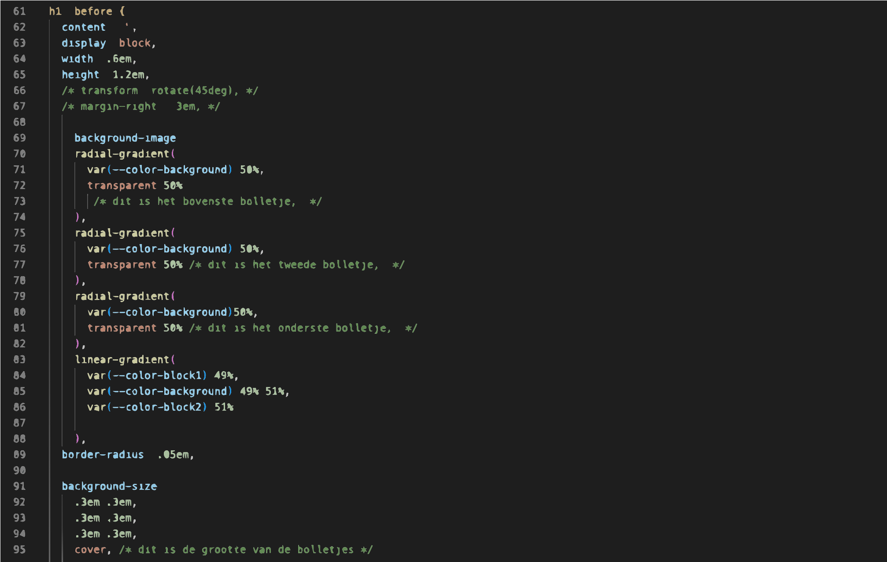
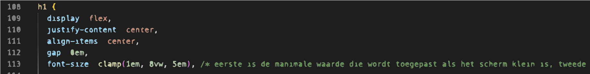
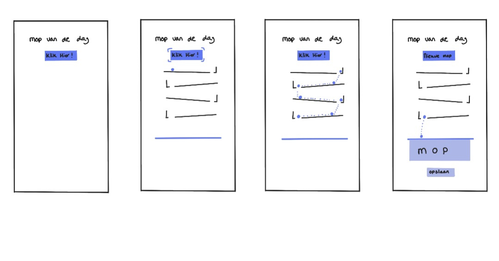

# Procesverslag
**Auteur:** -Sasja de Boer-

**De opdrachten:** [opdracht 1](opdracht1/index.html) en [opdracht 2](opdracht2/index.html)

Markdown is een simpele manier om HTML te schrijven.  
Markdown cheat cheet: [Hulp bij het schrijven van Markdown](https://github.com/adam-p/markdown-here/wiki/Markdown-Cheatsheet).

Nb. De standaardstructuur en de spartaanse opmaak van de README.md zijn helemaal prima. Het gaat om de inhoud van je procesverslag. Besteedt de tijd voor pracht en praal aan je website.

Nb. Door *open* toe te voegen aan een *details* element kun je deze standaard open zetten. Fijn om dat steeds voor de relevante stuk(ken) te doen.

## Bronnenlijst
  1. https://codepen.io/rociopromerosanchez/pen/GRWvZQM (voor het domino effect)
  2. https://codepen.io/shooft/pen/gOBWzOV?editors=1100 (code van Sanne voor begin domino)
  2. https://developer.mozilla.org/en-US/docs/Web/CSS/clamp (voor het responsive maken)
  3. -...-

## Opdracht 1 plan

  
uitwerken na schetsen idee (voor week 2)

  ### Je storyboard:
  

  ### Je ambitie: 
  Aan deze technieken/punten wil ik werken:
  - De letters laten veranderen in blokjes.
  - De blokjes zo draaien dat het een goed effect geeft.
  - De timing van de animatie, wanneer moet het volgende blokje "vallen".
  - Dat het helemaal goed mee schaalt, met hoe groot het scherm is.
 

## Opdracht 1 reflectie

  
uitwerken bij afronden opdracht (voor week 4)

  ### Je uitkomst - karakteristiek screenshot(s):
  
  

  ### Dit ging goed/Heb ik geleerd: 
  Korte omschrijving met plaatje(s)
  - Ik heb geleerd hoe je uberhaupt een animatie moet maken. Ik snapte er vrij weinig van en ik heb veel moeten opzoeken en uitzoeken, allereerst om te begrijpen hoe alles werkt. Uiteindelijk snap ik het nu wel wat beter.
  - Wat ik ook heb geleerd is om het logo met before neer te zetten. Ik had eerst geen idee hoe ik dat logo daar ging krijgen, maar met before en background image is het uiteindelijk gelukt. Ook had ik nog nooit met gradient gewerkt, maar dit werkt goed voor mijn logo.

  

  ### Dit was lastig/Is niet gelukt:
  Korte omschrijving met plaatje(s)
  - Het responsive maken, was eerst even last. Dit kwam omdat ik geen idee had hoe dit moest en dan wordt het ook lastig waar je op moet zoeken. Uiteindelijk herkende ik weer van de les hoe dit moest en toen kon ik beter zoeken en was het uiteindelijk helemaal niet zo lastig. Ik heb nu alleen dat het schaalt als je de breedte veranderd, maar zou dit eigenlijk ook wilen met de hoogte.

  

## Opdracht 2 plan

  
uitwerken na schetsen idee (voor week 5)

  ### Je ontwerp:
  

  ### Je ambitie: 
  Aan deze technieken/punten wil ik werken:
  - Dat de animatie start met een klik.
  - Dat de balletjes precies goed rollen en optijd stoppen en dan vallen.
  - Hoe je iets op een goede manier kan opslaan.
  - Hoe je een mop "random" kan kiezen en ook elke keer/dag een andere.

## Opdracht 2 test

  
uitwerken na testen (week 7)

  Neem minimaal 5 bevindingen op:

  ### Bevinding 1:
  Omschrijving van wat er nog niet orde was (tekst en afbeeding(en)).

  #### oplossing:
  Beschrijving hoe je het hebt hebt opgelost of als het niet gelukt is hoe je het zou oplossen (tekst en afbeeding(en)).

  ### Bevinding 2:
  Omschrijving van wat er nog niet orde was (tekst en afbeeding(en)).

  #### oplossing:
  Beschrijving hoe je het hebt hebt opgelost of als het niet gelukt is hoe je het zou oplossen (tekst en afbeeding(en)).

  ### Bevinding 3:
  ...

## Opdracht 2 reflectie

  
uitwerken bij afronden opdracht (voor week 8)

  ### Je uitkomst - karakteristiek screenshot(s):
  

  ### Dit ging goed/Heb ik geleerd: 
  Korte omschrijving met plaatje(s)

  

  ### Dit was lastig/Is niet gelukt:
  Korte omschrijving met plaatje(s)

  

